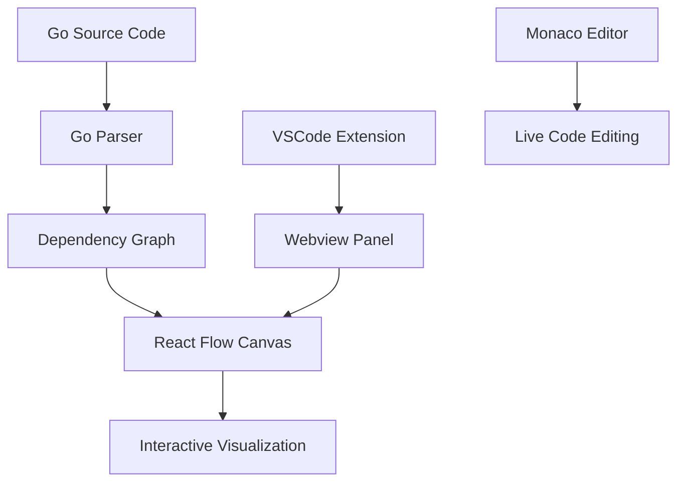

# GoFlow - Visual Go Code Navigator 🚀

## 📑 Table of Contents

- [🌟 Why Choose GoFlow?](#-why-choose-goflow)
- [🚀 Quick Start Guide](#-quick-start-guide)
- [🎨 Core Features](#-core-features)
- [⌨️ Comprehensive Keyboard Shortcuts](#️-comprehensive-keyboard-shortcuts)
- [🏗️ Architecture & Technology](#️-architecture--technology)
- [⚙️ Configuration Settings](#️-configuration-settings)
- [📖 Detailed Usage Guide](#-detailed-usage-guide)
- [🔧 Troubleshooting Common Issues](#-troubleshooting-common-issues)
- [🚀 Advanced Features](#-advanced-features-1)
- [📊 Performance Characteristics](#-performance-characteristics)
- [🤝 Contributing & Support](#-contributing--support)
- [📄 License & Attribution](#-license--attribution)

---

## 🌟 Why Choose GoFlow?

Tired of navigating complex Go codebases with endless files and dependencies? GoFlow transforms your code into an interactive visual graph, making it easy to understand function relationships, call hierarchies, and architectural patterns.

### 🎯 Key Benefits

- **🎨 Interactive Visualizations** - See your code as an interactive graph with function nodes and dependency edges
- **🔍 Smart Dependency Analysis** - Automatically detect function calls, method invocations, and type dependencies
- **📊 Multi-File Support** - Analyze dependencies across your entire project, not just single files
- **⚡ Real-time Code Editing** - Edit code directly in the visual nodes with Monaco editor integration
- **🎯 Intelligent Layouts** - Auto-detect framework patterns and apply optimal graph layouts
- **🔗 Cross-File Navigation** - Jump to function definitions with a single click

## 🚀 Quick Start Guide

### Installation

1. Open **VS Code Extensions** (`Ctrl+Shift+X` / `Cmd+Shift+X`)
2. Search for **"GoFlow - Visual Go Code Navigator"**
3. Click **Install** and reload VS Code when prompted

### Your First Flow

1. **Open a Go file** in your editor
2. **Press `Ctrl+Shift+G`** (Win/Linux) or `Cmd+Shift+G` (Mac)
3. **Select a function** from the quick pick menu
4. **Explore the canvas** - interact with nodes, follow edges, and understand your code structure!

## 🎨 Core Features

### 📊 Interactive Code Canvas

| Feature | Description | Shortcut |
|---------|-------------|----------|
| **Function Analysis** | Visualize function calls and dependencies | `Ctrl+Shift+G` |
| **Method Tracking** | Track method calls and receiver types | Automatic |
| **Type Dependencies** | Show struct, interface, and type usage | Automatic |
| **Cross-File Navigation** | Jump between files while maintaining context | Click nodes |

### 🎯 Smart Graph Features

```go
// GoFlow automatically detects and visualizes:
func main() {
    service := NewService()          // → Constructor calls
    result := service.Process(data)  // → Method calls with return values
    utils.Validate(result)           // → Package function calls
    defer cleanup()                  // → Deferred calls
}
```

### 📁 Advanced Project Management

- **Flow Collections**: Save and organize frequently analyzed functions
- **File Grouping**: Automatically group nodes by source file with visual containers
- **Node Visibility**: Show/hide specific nodes to focus on relevant code paths
- **Export Capabilities**: Export diagrams as PNG for documentation

### 🔄 Real-time Code Integration

- **Live Editing**: Edit code directly in canvas nodes with full syntax highlighting
- **Auto-refresh**: Canvas updates automatically when files change
- **Error Highlighting**: Visual indicators for problematic code paths
- **Code Navigation**: Click on function calls to trace execution paths

## ⌨️ Comprehensive Keyboard Shortcuts

### Core Operations

| Action | Windows/Linux | macOS | Context |
|--------|---------------|-------|---------|
| Show GoFlow Canvas | `Ctrl+Shift+G` | `Cmd+Shift+G` | Go files |
| Refresh Canvas | `Ctrl+Shift+R` | `Cmd+Shift+R` | Canvas visible |
| Export Diagram | `Ctrl+Shift+E` | `Cmd+Shift+E` | Canvas visible |
| Toggle Fullscreen | `F11` | `F11` | Canvas visible |

### Canvas Navigation

| Action | Method | Description |
|--------|---------|-------------|
| Zoom | Mouse Wheel | Zoom in/out |
| Pan | Click + Drag | Move around canvas |
| Fit View | Auto-fit button | Center all nodes |
| Node Selection | Click | Select and focus nodes |

## 🏗️ Architecture & Technology

Built with modern TypeScript, React Flow, and Monaco Editor, featuring a sophisticated parser for Go code analysis.



### Technical Stack

- **Frontend**: React Flow, Monaco Editor, Tailwind CSS
- **Backend**: TypeScript, VSCode Extension API
- **Parsing**: Go Symbol Provider, Abstract Syntax Tree analysis
- **Layout**: Dagre, ELK, D3-force algorithms

## ⚙️ Configuration Settings

Access via VS Code Settings (`Ctrl+,` / `Cmd+,`):

```json
{
  "goflow.layout": "dagre",
  "goflow.showTypes": true,
  "goflow.showInterfaces": true,
  "goflow.autoRefresh": true,
  "goflow.maxNodes": 100,
  "goflow.enableJumpToFile": true
}
```

### Layout Algorithms

- **Dagre**: Hierarchical top-down layouts (default)
- **ELK Layered**: Handles complex dependencies with circular references
- **D3 Force**: Force-directed layouts for organic node arrangement
- **ELK Force**: Hybrid approach for reactive patterns

## 📖 Detailed Usage Guide

### Analyzing Function Dependencies

1. **Open a Go file** containing functions or methods
2. **Launch GoFlow** using the command palette or keyboard shortcut
3. **Select target function** from the quick pick list
4. **Explore the graph**:
   - Solid edges → function calls with return values
   - Dashed edges → void function calls
   - Numbered edges → execution order
   - Color-coded nodes → functions (green) vs methods (blue)

### Working with the Canvas

```go
// Example: Complex function call hierarchy
func HandleRequest(req *Request) Response {
    validator := NewValidator()
    if err := validator.Validate(req); err != nil {  // → Method call
        return ErrorResponse(err)                    // → Function call
    }
    
    processor := GetProcessor(req.Type)              // → Factory function
    result := processor.Process(req.Data)           // → Interface method
    return SuccessResponse(result)                   // → Function call
}
```

### Advanced Features

#### Call Order Tracking
GoFlow analyzes execution order and displays call sequence numbers on edges, helping you understand the flow of execution through your code.

#### Return Value Detection
The extension intelligently detects whether function return values are used, displaying solid lines for value-returning calls and dashed lines for void calls.

#### Multi-Language Framework Detection
While optimized for Go, GoFlow can detect patterns from other languages and apply appropriate layout strategies.

## 🔧 Troubleshooting Common Issues

### Performance Optimization

For large codebases (50+ nodes):

- Use node visibility controls to focus on relevant paths
- Enable "autoRefresh" only when needed
- Adjust "maxNodes" setting based on your system capabilities
- Use file grouping to organize related nodes

### Parsing Issues

If dependencies aren't being detected:

1. Ensure your Go project is properly built and indexed
2. Check that function definitions are resolvable (no build errors)
3. Verify the function is exported if analyzing cross-package calls
4. Check extension logs via "GoFlow" output channel

### Visualization Tips

- Use the mini-map for quick navigation in large graphs
- Leverage auto-layout for optimal node positioning
- Create flow collections for frequently analyzed functions
- Export important diagrams for documentation purposes

## 🚀 Advanced Features

### Framework-Aware Layouts

GoFlow automatically detects code patterns and applies optimal layouts:

- **Go Gin/Echo**: Top-down hierarchical (Handler → Service → Repository)
- **gRPC Services**: Left-right flow for service chains
- **Concurrent Patterns**: Force-directed layouts for goroutine interactions

### Smart Edge Routing

```go
// GoFlow optimizes edge paths for readability
func ComplexFlow() {
    // These calls get smart edge routing
    result := transformData(           // → Curved edges around nodes
        fetchFromDB(query),           // → Hierarchical ordering
        config.ProcessingTimeout,     // → Minimal edge crossing
    )
}
```

### Real-time Collaboration Features

- **Live Code Updates**: Edit code in nodes and see changes reflected in real-time
- **Path Highlighting**: Click on code lines to highlight execution paths
- **Focus Mode**: Isolate specific call chains for detailed analysis

## 📊 Performance Characteristics

| Operation | Typical Speed | Large Project Impact |
|-----------|---------------|---------------------|
| File Analysis | 1-3 seconds | Moderate |
| Graph Generation | 2-5 seconds | Moderate-High |
| Canvas Rendering | Instant | Low |
| Layout Calculation | 1-4 seconds | Moderate |

## 🤝 Contributing & Support

### Community Support

- 📚 [Documentation Wiki](https://github.com/khanhromvn/goflow/wiki)
- 🐛 [Issue Tracker](https://github.com/khanhromvn/goflow/issues)
- 💡 [Feature Requests](https://github.com/khanhromvn/goflow/discussions)

### Development Setup

```bash
git clone https://github.com/khanhromvn/goflow.git
cd goflow
npm install
npm run watch
```

Press `F5` to launch extension development host.

## 📄 License & Attribution

**MIT License** - See full license text in repository.

Built with ❤️ by [Khanh Nguyen](https://github.com/khanhromvn) and contributors.