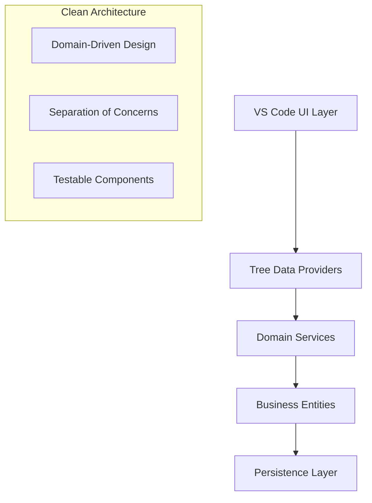

# Copy Path with Code 📋✨

A powerful Visual Studio Code extension that revolutionizes how you copy, organize, and manage code snippets with file context. Perfect for developers who need to share code with proper file references and maintain organized collections of related files.


## 🌟 Why Choose Copy Path with Code?

Tired of copying code without context? This extension solves the common problem of sharing code snippets without losing the crucial file path information. Whether you're collaborating with team members, creating documentation, or organizing your code references, Copy Path with Code enhances your workflow with intelligent clipboard management and file organization.

### 🎯 Key Benefits

- **📋 Context-Aware Copying** - Copy code with full file path and formatting
- **📁 Visual File Organization** - Create custom folders to group related files
- **🔄 Smart Clipboard Management** - Track and manage multiple copied files
- **🔍 Advanced Search** - Quickly find files across your organized collections
- **⚡ Performance Optimized** - Lightweight and fast, even with large codebases

## 🚀 Quick Start Guide

### Installation

1. Open **VS Code Extensions** (`Ctrl+Shift+X` / `Cmd+Shift+X`)
2. Search for **"Copy Path with Code"**
3. Click **Install** and reload VS Code when prompted

### Your First Copy

1. **Open any file** in your editor
2. **Select text** (optional) or keep cursor position for full file content
3. **Press `Ctrl+Alt+C`** (Win/Linux) or `Cmd+Alt+C` (Mac)
4. **Paste anywhere** - get beautifully formatted output with path and code!

**Example Output:**

```
src/utils/logger.ts:
```

```typescript
export class Logger {
  static info(message: string) {
    console.log(`INFO: ${message}`);
  }
}
```

## 🎨 Core Features

### 📋 Intelligent Copy Operations

| Feature                     | Description                                              | Shortcut        |
| --------------------------- | -------------------------------------------------------- | --------------- |
| **Basic Copy**              | Copy file path with content in markdown format           | `Ctrl+Alt+C`    |
| **Error Context Copy**      | Include error messages and diagnostic information        | `Ctrl+Alt+A`    |
| **Selection Copy**          | Copy specific code sections with line numbers            | (Auto-detected) |
| **Multi-file Accumulation** | Collect multiple files in clipboard for batch operations | (Automatic)     |

### 📁 Advanced Folder Management

```typescript
// Create organized collections of related files
const folderFeatures = {
  visualOrganization: "Tree-view interface with expandable folders",
  batchOperations: "Add/remove multiple files with selection interface",
  workspaceIsolation: "Separate folders per workspace or global access",
  quickAccess: "Right-click context menus for all operations",
};
```

### 🔄 Clipboard Ecosystem

- **Temporary Storage**: Workspace-specific clipboard preservation
- **Content Detection**: Automatic parsing of files from clipboard content
- **Integrity Protection**: Monitoring against external clipboard changes
- **Visual Queue**: Dedicated panel for detected clipboard files

### 🔍 Smart Search & Navigation

- **Real-time filtering** of files and folders
- **Case-sensitive options** in settings
- **Quick file actions** through comprehensive context menus
- **Cross-workspace file handling** with visual indicators

## ⌨️ Comprehensive Keyboard Shortcuts

### Core Operations

| Action                  | Windows/Linux | macOS       | Context        |
| ----------------------- | ------------- | ----------- | -------------- |
| Copy Path + Content     | `Ctrl+Alt+C`  | `Cmd+Alt+C` | Editor focused |
| Copy with Errors        | `Ctrl+Alt+A`  | `Cmd+Alt+A` | Editor focused |
| Transfer Temp to System | `Ctrl+Alt+Q`  | `Cmd+Alt+Q` | Any            |
| Clear Temp Storage      | `Ctrl+Alt+Z`  | `Cmd+Alt+Z` | Any            |

### Folder Management

| Action             | Shortcut           | Context      |
| ------------------ | ------------------ | ------------ |
| Add to Folder      | `Ctrl+Alt+Shift+A` | File focused |
| Remove from Folder | `Ctrl+Alt+D`       | File focused |
| Search Files       | `Ctrl+Alt+F`       | Folder view  |

## 🏗️ Architecture & Technology

Built with modern TypeScript and VS Code extension APIs, featuring a clean architecture pattern for maintainability and extensibility.



## ⚙️ Configuration Settings

Access via VS Code Settings (`Ctrl+,` / `Cmd+,`):

```json
{
  "copyPathWithCode.enableClipboardDetection": true,
  "copyPathWithCode.enableTempStorage": true,
  "copyPathWithCode.tempStorageCleanupDays": 7,
  "copyPathWithCode.showFileCount": true,
  "copyPathWithCode.searchCaseSensitive": false,
  "copyPathWithCode.searchIncludeExtensions": true
}
```

## 📖 Detailed Usage Guide

### Creating and Managing Folders

1. **Open Code Folders View**: Click the folder icon in the activity bar
2. **Create New Folder**: Click the + button in the view title bar
3. **Add Files**: Right-click folder → "Add Files to Folder"
4. **Organize**: Use drag-to-select or shift-click for multiple files

### Advanced Clipboard Techniques

```typescript
// Example: Multi-file workflow for documentation
const workflow = {
  step1: "Copy several related files using Ctrl+Alt+C",
  step2: "Save to temporary storage with Ctrl+Alt+Q",
  step3: "Switch to different workspace or project",
  step4: "Restore clipboard contents when needed",
  step5: "Paste all files as formatted markdown",
};
```

### Search and Discovery

- Use `Ctrl+Alt+F` in folder view to search across all files
- Filter by file name, extension, or content type
- Search results show match counts and quick navigation

## 🔧 Troubleshooting Common Issues

### Performance Optimization

For large codebases (1000+ files):

- Enable "searchIncludeExtensions" to filter by file type
- Use workspace-specific folders instead of global view
- Clear temporary storage periodically

### Clipboard Detection Issues

If automatic detection isn't working:

1. Check `copyPathWithCode.enableClipboardDetection` setting
2. Verify clipboard content format matches expected patterns
3. Check extension logs via "Show Extension Logs" command

### File Organization Tips

- Use descriptive folder names for better searchability
- Leverage the multi-select interface for batch operations
- Utilize different workspaces for separate project contexts

## 🚀 Advanced Features

### Cross-Workspace File Handling

The extension intelligently handles files across different VS Code workspaces, providing visual indicators and maintaining relative paths where possible.

### Customizable Themes

The extension respects VS Code theme colors and provides additional color customization points for:

- Different workspace indicators
- Search highlights
- Status bar elements
- Folder hierarchy visual cues

### Extension API Integration

While primarily a UI extension, it integrates deeply with VS Code's:

- File system providers
- Clipboard APIs
- Workspace management
- Editor selection context

## 📊 Performance Characteristics

| Operation           | Typical Speed | Large Project Impact  |
| ------------------- | ------------- | --------------------- |
| File Copy           | Instant       | Minimal               |
| Folder Creation     | <100ms        | Low                   |
| Search Filtering    | <50ms         | Medium (with caching) |
| Clipboard Detection | <200ms        | Low                   |

## 🤝 Contributing & Support

### Community Support

- 📚 [Documentation Wiki](https://github.com/khanhromvn/copy-path-with-code/wiki)
- 🐛 [Issue Tracker](https://github.com/khanhromvn/copy-path-with-code/issues)
- 💡 [Feature Requests](https://github.com/khanhromvn/copy-path-with-code/discussions)

### Development Setup

```bash
git clone https://github.com/khanhromvn/copy-path-with-code.git
cd copy-path-with-code
npm install
npm run watch
```

Press `F5` to launch extension development host.

## 📄 License & Attribution

**MIT License** - See full license text in repository.

Built with ❤️ by [Khanh Nguyen](https://github.com/khanhromvn) and contributors.

## 🔄 Version History

### v1.0.1 (Current)

- Enhanced folder management system
- Improved cross-workspace file handling
- Optimized performance for large codebases
- Additional color customization points

### v1.0.0

- Initial public release
- Core copying functionality
- Basic folder management
- Clipboard detection system

---

**Pro Tip**: Use the status bar indicators for quick access to clipboard counts and temporary storage management. The extension becomes more powerful as you build collections of commonly used code snippets!

Happy coding! 🎉
